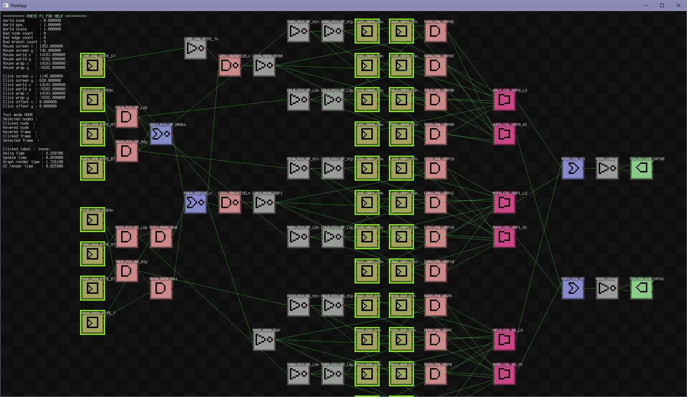

# This repo is the home of MetroBoy, GateBoy, and Plait.

## GateBoy

GateBoy is a **gate-level simulation** of the original Game Boy hardware that was [**reverse-engineered from die shots of the original DMG-01 chip**](https://siliconpr0n.org/map/nintendo/dmg-cpu-b/mz_mit20x/#x=9744&y=8000&z=3). It includes all the standard cells on the chip, minus the audio (too slow). It does not currently simulate the CPU at the gate level - it's made of custom logic and is a bit too blurry for me to decipher. GateBoy's CPU is instead my current best guess at how it might be implemented given the constraints implied by the rest of the chip.

I owe a **huge** amount of thanks to [Furrtek](https://github.com/furrtek) for his original [die traces](https://github.com/furrtek/DMG-CPU-Inside/blob/master/preview.png) and [schematics](https://github.com/furrtek/DMG-CPU-Inside) that served as a [Rosetta Stone](https://en.wikipedia.org/wiki/Rosetta_Stone) for getting the whole translation started. I've noted in the codebase where I found errors in the schematics - some have been reported back to Furrtek but there are still a lot of discrepancies.

Big thanks are also owed to [Gekkio](https://github.com/gekkio) for his [Mooneye emulator](https://github.com/Gekkio/mooneye-gb) and tests that helped bootstrap Gateboy, and for the flash cart he designed that I used to build many many additional tests.

## GateBoy FAQ

- How is this simulation connected to the Furrtek schematics?
  - Every gate in the Furrtek schematics has a corresponding line in the GateBoy source code. Lines are tagged like this - `/*#p08.ASUR*/` - this means that gate ASUR is on page 8 of the schematics, and the '#' indicates that I've manually traced the gate to verify that the schematic is correct.
  - Here's a chunk of the unmodified die shot with ASUR in the middle - 
  - Here's the same chunk with Furrtek's annotations - 
  - And here's a closeup - 
  - which corresponds to this ASUR in Furrtek's schematic - 
  - which in turn gets translated to this ASUR in GateBoy's code - 
  - Repeat that a few thousand times, spend a year-ish debugging, and you get GateBoy. 

- How is this simulation tested?
  - GateBoy has a fairly comprehensive test suite that runs all of [the Mooneye tests](https://github.com/Gekkio/mooneye-gb/tree/master/tests), as well as a large suite of "micro-tests" that execute in a small number of cycles.
  - GateBoy can also do automated render tests (used for [Mealybug's test suite](https://github.com/mattcurrie/mealybug-tearoom-tests)), but those are currently disabled.
  - There are probably a few plain old code bugs remaining as well. Right now one of the early screens in Zelda is doing something funny with the grass tiles...

- Is GateBoy a perfect simulation of a Game Boy?
  - Actually no, for complicated reasons. The Game Boy chip has a handful of logic gates that operate [independently of the master clock](https://en.wikipedia.org/wiki/Asynchronous_circuit) and whose exact behavior depends on things like [gate delay](https://en.wikipedia.org/wiki/Propagation_delay). These gates create [glitches](https://en.wikipedia.org/wiki/Glitch) that depend heavily on the physical placement of the gates, the silicon process used to make them, and other weird things like temperature and voltage.
  - For example, there's a glitch in the external address bus logic that causes internal bus addresses like `0xFF20` to appear on the external bus even though the logic should prevent that. Due to input delays, not all of the inputs to gate `LOXO` (page 8 in the schematic) arrive at the same time. This causes `LOXO` to produce a glitch pulse that in turn causes latch `ALOR` to make a copy of one bit of the internal bus address. `ALOR` then drives that bit onto the external bus (through a few more gates) where it can be seen with an oscilloscope or logic analyzer.

- Wait, if glitches don't show up in the schematics then how did you figure that one out?
  - In this case we can deduce what's going on because we can see the side-effect of the glitch on the external bus and there's not that many possible ways that address signal could've gotten there.
  - Other internal glitches are harder to figure out because they don't affect external circuits - they just show up as "something does not match the simulation". There are probably 4-5 glitches that need to be tracked down somehow before the simulation is "perfect", but I'm not going to block the release of GateBoy until I find them.

- Why is GateBoy so slow?
  - GateBoy simulates every logic gate on the DMG chip, one gate at a time. Adding two 8-bit values isn't simulated as "a = b + c;", it's simulated as eight 1-bit adders and eight 1-bit registers and all the control logic that goes along with it.
  - In debug builds, all gates also includes a bunch of error checking to verify that gates aren't read before they're updated, that buses aren't floating, that the simulation always stabilizes, and other things like that.
  - GateBoy also simulates every clock _phase_, not just individual clock cycles. While you may have read that the Game Boy runs at 1 megahertz, this is not quite correct. The 4.19 megahertz clock crystal feeds a set of gates `AFUR+ALEF+APUK+ADYK` that produce four 1 mhz clocks that are out of phase with each other. Those clocks are then combined by additional logic to create sub-clocks of various patterns and frequencies whose edges can lie on either the positive or negative edges of the 4.19 mhz master clock. So, it's more accurate to say that the Game Boy has a 1-megahertz, 8-phase clock. In GateBoy we give each phase a letter (A through H) and all sub-clocks have a suffix like this - `BALY_xBCDEFGH` - which indicates that the clock generated by gate BALY is high on phases B through H.
  - Even with heroic optimization and all the error checking turned off in "fast mode", we still only hit 6-8 fps on a modern CPU.

- Why is GateBoy so fast?
  - Aha, now we're asking interesting questions. Simulating hardware in software is usually 1000's of times slower than realtime - GateBoy is "only" 8x slower than realtime. How does it do that?
  - GateBoy is designed so that most of the simulated gates optimize down to a single instruction or less after the compiler's optimization pass - one "and" gate turns into one "and" instruction, chains of "not" gates get optimized out, etcetera.
  - Normally this would require a huge amount of simulation infrastructure to ensure that the simulation doesn't diverge from the "real world" circuit. GateBoy doesn't do this. Instead, GateBoy does all its error checking by adding additional flags to each wire and register and verifying (in debug builds) that every gate is evaluated correctly.
  - The flags are set up so that they don't interfere with the usual one-instruction-per-gate operations, and in optimized builds the additional flags are disabled entirely.

- Wouldn't it be even faster to write this in Verilog and then simulate it in Verilator or something?
  - You would think so, and I have translated small portions of GateBoy into Verilog and simulated them in Verilator just to prove that GateBoy's simulation strategy does produce correct results. However, the Verilated code is still around 5-10x slower than GateBoy compiled in "fast mode".

- Does it run in Linux?
  - Yes, all the code is cross-platform and there's a trivial build.ninja file that will compile a set of "fast mode" executables into bin/.

# What happened to MetroBoy?

MetroBoy is/was a higher level Game Boy emulator. I got it to the point where it passed virtually all the available tests, and then hacked it up in various ways to help get GateBoy working. MetroBOy is currently broken, don't use it. It will be coming back eventually.

# What's Plait?

Plait is a tool for visualizing and untangling the mess of gates that makes up GateBoy. It's not at all finished yet, but there's enough functionality to be useful. It's also quite fun to poke around in the graph and see how things like the pixel pipe are actually implemented, gate-wise. The pic above is the "pixel output" circuit that merges the background tile pixels with the sprite pixels, applies the color palettes, and sends the pixels to the LCD.

Plait **parses the GateBoy source code**, extracts all tagged (`/*#p08.ASUR*/`) lines, and converts the result to an editable graph. To make the level of complexity more manageable, Plait includes multiple editing features to help modularize and untangle the graph.

## So what comes after GateBoy?

The next step after this is LogicBoy, which will be a simulation that's equivalent at the register level to GateBoy but expresses the logic in more conventional C instead of and/or/not/etc. gates.

## And after that?

MetroBoy will be rewritten so that its externally visible behavior exactly matches LogicBoy.

# That's a lot of stuff. What's the overarching point of all this, anyhow?

GateBoy, LogicBoy, and MetroBoy exist to give me a starting point for working on Metron, which is my long-term project to build a set of programming tools that can bridge between the C/C++ universe used by software and the Verilog/VHDL universe used by hardware. Eventually there will be a single codebase that, using some custom tools, can be translated directly to C++ and run on a PC or that can be translated to SystemVerilog and run on a FPGA.

