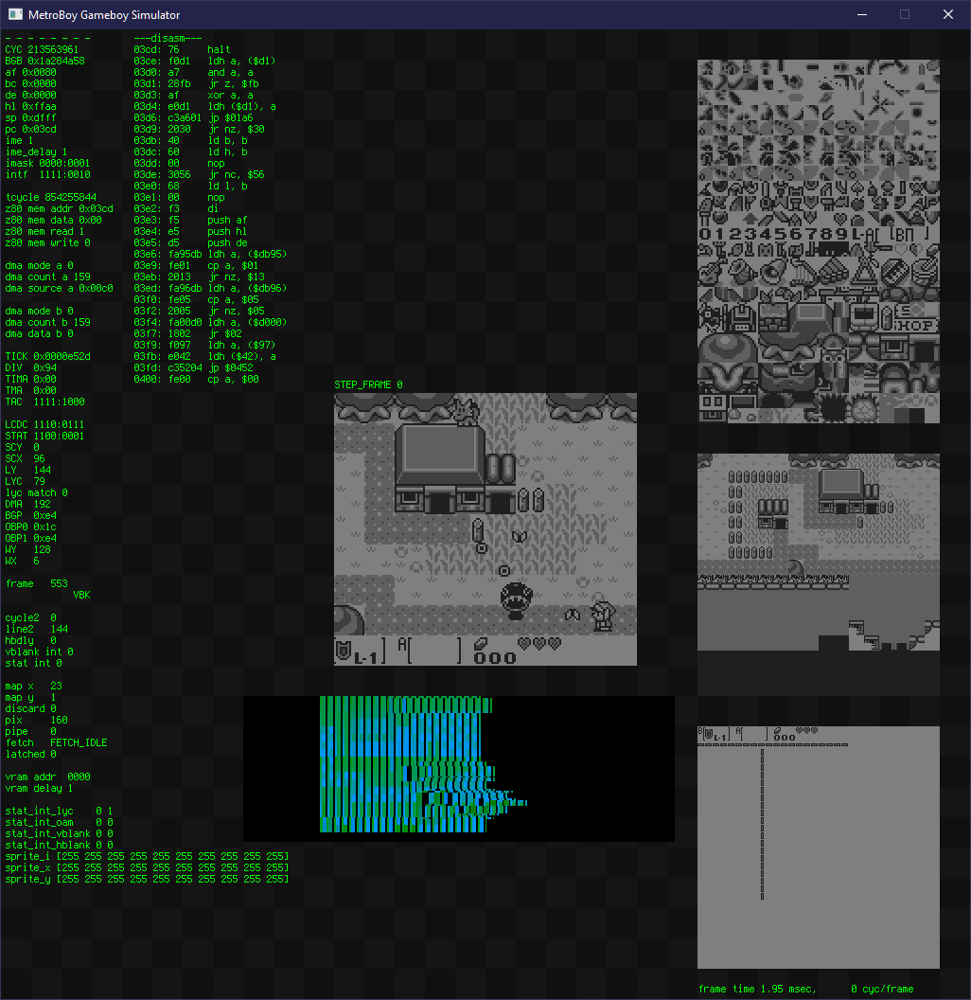

# MetroBoy is a Game Boy simulation designed to be mechanically translated into Verilog

(Note - Interrupt timing is currently more broken than intended, but it should be able to run Prehistorik Man now)

----------

**TL;DR - Drag and drop rom files into the window to load them. Only first-gen Game Boy games that use the MBC1 controller are supported - Game Boy Color roms will not work.**

## Game controls:

- Dpad = arrow keys
- B = Z
- A = X
- Select = shift
- Start = enter

## Debug controls:

- R = Reset
- F = Fast mode
- V = Vsync mode (default)
- S = Step mode
- F1 = Load state
- F4 = Save state
- ESC = Quit

In step mode, up/down changes step granularity (frame/line/cycle) and left/right steps forward/back. Shift-right can be used to step over long instructions like loops and halts.

----------

## MetroBoy isn't an emulator in the traditional sense

It's comparatively slow, though you can use it to play Game Boy games. It should run at full speed on most modern processors, with my current laptop running at about 2.5x realtime in fast mode.

MetroBoy is more like a Verilog simulation of a Game Boy that's been translated into C++. You can also think of it as being written in a subset of C++ that's designed to to be mechanically translated into synthesizable Verilog.

MetroBoy is part of a larger project named Metron, which is a C-to-Verilog translator based on LLVM that I'm still working on. Portions of MetroBoy have been validated by translating them from C to Verilog using Metron, translating that back to C using Verilator, then asserting that all the registers match up. MetroBoy usually runs between 3x-5x faster than the C->Verilog->Verilator->C version.

----------

## MetroBoy screen contents 

Left columns
- CPU registers
- Memory bus
- DMA state
- Timer state
- PPU registers
- PPU state
- Sprite state
- Disassemby

Center column
- Gameboy screen
- 'Oscilloscope' view showing memory accesses per cycle (see Gameboy::trace)

Right column
- Tile memory
- Tile map 0
- Tile map 1

----------

## FAQ

- Why is MetroBoy so slow?
  - MetroBoy simulates a Game Boy the hard way - in vsync mode it's simulating 4213440 full clock ticks per second. In fast mode it runs at about 10M clock ticks per second, or around 300 cycles per tick - not bad considering that the simulation does terrible things to branch predictors.
- How accurate is MetroBoy's simulation?
  - Very, very accurate. It should run any ROM you throw at it, though there are a few corner cases regarding sprite vs. scroll timing that fail in Wilbert Pol's test suite.
- How are you drawing the UI?
  - Raw pixel writes to a SDL surface.

----------

## Known Issues

- The code is a mix of DMG (original Game Boy) and AGS (Game Boy Advance SP) configurations and will fail a few compatibility tests due to the inconsistency.
- The sound hardware implementation is buggy
- Save game support isn't implemented yet
- Cross-platform support via CMake is coming. Nothing in MetroBoy is OS-specific, I just haven't set it up yet.
- The window overlay is off by 8 pixels. :/
